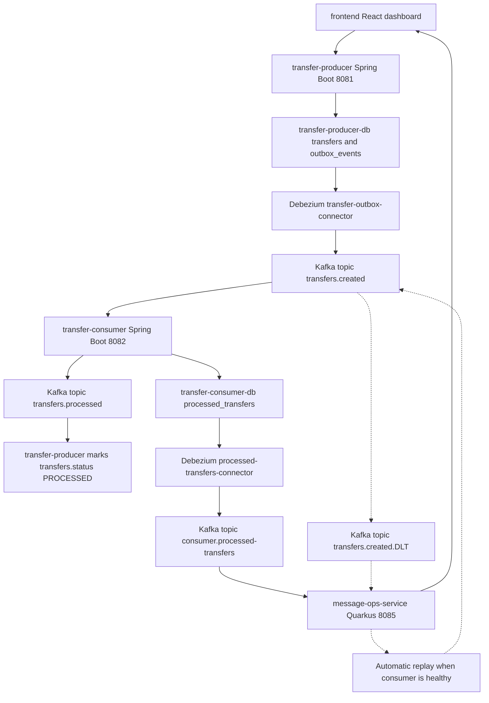

# zero-message-loss

Demo of **guaranteed message delivery** for banking transfers using Transactional Outbox, Debezium CDC, Kafka, DLT, automatic replay, and consumer database confirmation.

The core idea is simple: when a transfer is created, the system stores the transfer and its event in the same database transaction. Debezium reads the outbox from the Neon WAL and publishes the event to Kafka. If the consumer fails, Spring Kafka sends the message to a Dead Letter Topic. Then `message-ops-service` automatically replays it when the consumer is healthy again, and the frontend shows in real time when the event is finally persisted in `transfer-consumer-db.processed_transfers`.

---

## Architecture



---

## Services

| Service               | Stack                         | Port | Responsibility                                                                               |
| --------------------- | ----------------------------- | ---: | -------------------------------------------------------------------------------------------- |
| `transfer-producer`   | Spring Boot 4 + JDK 25        | 8081 | Creates transfers and writes outbox events atomically                                        |
| `transfer-consumer`   | Spring Boot 4 + JDK 25        | 8082 | Consumes `transfers.created`, persists `processed_transfers`, exposes demo control endpoints |
| `message-ops-service` | Quarkus 3.35 + JDK 25         | 8085 | Streams Kafka events to the frontend, replays DLT events, proxies consumer controls          |
| `frontend`            | React 19 + Vite 8 + shadcn/ui | 5173 | Demo dashboard: create transfers, trigger failures, watch live/DLT/DB confirmation           |

---

## Hexagonal Architecture

All backend microservices follow a hexagonal architecture style. The domain and application layers contain the business rules and use cases, while REST, Kafka, persistence, HTTP clients, Protobuf serialization, and SSE concerns live at the edges as adapters.

### `transfer-producer`

`transfer-producer` keeps transfer creation and producer-side status updates in the application layer:

- `domain.model` contains the `Transfer` and `OutboxEvent` models.
- `application.ports.input` exposes use cases such as creating transfers and marking transfers as processed.
- `application.ports.output` defines persistence and event serialization contracts.
- `application.usecase` implements the transactional outbox flow: save the transfer and its outbox event in the same database transaction.
- `adapters.input.rest` receives `POST /transfers` requests and maps HTTP DTOs into application commands.
- `adapters.input.kafka` consumes `transfers.processed` confirmations.
- `adapters.output.persistence` provides Spring Data JPA repositories.
- `adapters.output.serialization` builds the Protobuf transfer event payload.

### `transfer-consumer`

`transfer-consumer` separates Kafka transport details from transfer processing:

- `domain.model` contains the persisted `ProcessedTransfer` model.
- `application.model` contains the application-level `TransferEventPayload`, independent from Protobuf.
- `application.ports.input` exposes processing and consumer-control use cases.
- `application.ports.output` defines persistence and processed-event publishing contracts.
- `application.usecase` handles idempotent transfer processing, failure-mode control, and publishing processed confirmations.
- `adapters.input.kafka` parses incoming Protobuf/Base64 Kafka payloads and delegates to the processing use case.
- `adapters.input.rest` exposes the demo control endpoints.
- `adapters.output.persistence` stores processed transfers with JPA.
- `adapters.output.messaging` publishes `transfers.processed` events to Kafka.

### `message-ops-service`

`message-ops-service` acts as the operational boundary for the demo dashboard:

- `application.model` contains DTOs used by the event streams and consumer-control proxy.
- `application.mapper` maps Debezium and Protobuf payloads into dashboard-facing models.
- `application.usecase` owns SSE stream fan-out and DLT replay orchestration.
- `adapters.input.messaging` consumes Kafka topics for live transfers, DLT events, and processed-transfer confirmations.
- `adapters.input.rest` exposes SSE streams and consumer-control proxy endpoints.
- `adapters.output.http` calls `transfer-consumer` control endpoints.

## Infrastructure

| Container   |                           Port | Responsibility                               |
| ----------- | -----------------------------: | -------------------------------------------- |
| `zookeeper` |                           2181 | Kafka coordination                           |
| `kafka`     | 9092 external / 29092 internal | Message broker                               |
| `debezium`  |                           8083 | Kafka Connect + Debezium Postgres connectors |
| `kafka-ui`  |                           8080 | Kafka topic and consumer browser             |

---

## Kafka Topics

| Topic                          | Producer                                                | Consumer                                              |
| ------------------------------ | ------------------------------------------------------- | ----------------------------------------------------- |
| `transfers.created`            | Debezium outbox connector, `message-ops-service` replay | `transfer-consumer`, `message-ops-service`            |
| `transfers.processed`          | `transfer-consumer`                                     | `transfer-producer`                                   |
| `transfers.created.DLT`        | `transfer-consumer` error handler                       | `transfer-consumer` DLT logger, `message-ops-service` |
| `consumer.processed-transfers` | Debezium processed-transfers connector                  | `message-ops-service`                                 |

---

## Databases

### `transfer-producer-db`

Hibernate creates/updates:

- `transfers`
- `outbox_events`

Debezium reads `outbox_events` and publishes the Protobuf payload to `transfers.created`.
`transfer-producer` also consumes `transfers.processed` and marks the matching `transfers` row as `PROCESSED`.

### `transfer-consumer-db`

Hibernate creates/updates:

- `processed_transfers`

Debezium reads `processed_transfers` and publishes database confirmations to `consumer.processed-transfers`.

---

## Shared Event Schema

All backend services generate Java classes from [proto/transfer_event.proto](proto/transfer_event.proto):

```proto
message TransferEvent {
  string event_id = 1;
  string transfer_id = 2;
  string from_account = 3;
  string to_account = 4;
  string amount = 5;
  string currency = 6;
  string status = 7;
  int64 created_at = 8;
}
```

`event_id` is the idempotency key used by `transfer-consumer`.

---

## Setup

### 1. Start infrastructure

```bash
docker compose up -d
```

### 2. Enable logical replication in Neon

Enable **Logical Replication** in both Neon projects:

- `transfer-producer-db`
- `transfer-consumer-db`

### 3. Create publications

Run in `transfer-producer-db`:

```sql
CREATE PUBLICATION transfer_publication FOR TABLE outbox_events;
```

Run in `transfer-consumer-db`:

```sql
CREATE PUBLICATION processed_transfers_publication
FOR TABLE public.processed_transfers;
```

### 4. Register Debezium connectors

```bash
cd debezium
bash register-producer-connector.sh
bash register-consumer-connector.sh
```

Verify:

```bash
curl http://localhost:8083/connectors/transfer-outbox-connector/status
curl http://localhost:8083/connectors/processed-transfers-connector/status
```

Both tasks should be `RUNNING`.

### 5. Start services

```bash
cd transfer-producer
./mvnw spring-boot:run "-Dspring-boot.run.profiles=local"
```

```bash
cd transfer-consumer
./mvnw spring-boot:run "-Dspring-boot.run.profiles=local"
```

```bash
cd message-ops-service
./mvnw quarkus:dev
```

```bash
cd frontend
npm install
npm run dev
```

---

## Useful URLs

| URL                                    | Description                           |
| -------------------------------------- | ------------------------------------- |
| http://localhost:5173                  | Frontend dashboard                    |
| http://localhost:8080                  | Kafka UI                              |
| http://localhost:8081/transfers        | Transfer producer API                 |
| http://localhost:8082/consumer/status  | Transfer consumer status              |
| http://localhost:8083/connectors       | Debezium connectors                   |
| http://localhost:8085/events/stream    | SSE live transfer events              |
| http://localhost:8085/events/dlt       | SSE DLT/replay events                 |
| http://localhost:8085/events/processed | SSE consumer DB confirmations         |
| http://localhost:8085/consumer/status  | Message ops proxy for consumer status |

---

## Runtime Flow

### Normal transfer

1. The frontend sends `POST /transfers` to `transfer-producer`.
2. `CreateTransferService` inserts `transfers` and `outbox_events` in one transaction.
3. Debezium reads `outbox_events` and publishes to `transfers.created`.
4. `transfer-consumer` parses the Protobuf event and inserts `processed_transfers`.
5. `transfer-consumer` publishes a `transfers.processed` confirmation event.
6. `transfer-producer` consumes `transfers.processed` and marks its own `transfers.status` as `PROCESSED`.
7. Debezium reads `processed_transfers` and publishes to `consumer.processed-transfers`.
8. `message-ops-service` streams the DB confirmation to the frontend.

### DLT + automatic recovery

1. Enable failure mode from the frontend.
2. Create a transfer.
3. `transfer-consumer` throws during processing.
4. Spring Kafka retries and sends the message to `transfers.created.DLT`.
5. `message-ops-service` shows the event as `DLT_PENDING`.
6. Restore processing from the frontend.
7. `message-ops-service` replays the original payload to `transfers.created`.
8. The card changes to `DLT_REPLAYED`.
9. When `processed_transfers` is written in `transfer-consumer-db`, the frontend shows `Consumer DB confirmed`.

---

## Transfer Consumer Demo Controls

`transfer-consumer` exposes:

```http
GET  /consumer/status
POST /consumer/fail-processing
POST /consumer/restore-processing
```

The frontend calls these through `message-ops-service` at:

```http
GET  /consumer/status
POST /consumer/fail-processing
POST /consumer/restore-processing
```

`fail-processing` intentionally throws inside the listener so Kafka retries and eventually sends the message to DLT. `restore-processing` turns processing back on so `message-ops-service` can replay pending DLT messages automatically.

---

## Frontend Architecture

The frontend is organized around `shared` infrastructure plus domain-oriented `features`:

- `frontend/src/shared/components` contains reusable UI building blocks, including shadcn/ui components.
- `frontend/src/shared/config` contains app-wide configuration such as environment-derived URLs.
- `frontend/src/shared/lib` contains global utilities.
- `frontend/src/shared/layout` contains dashboard composition components such as the top, live, and DLT panels.
- `frontend/src/features/agent-widget` contains the Aura agent widget component, hook, and types.
- `frontend/src/features/events` contains event stream rendering and event-specific helpers, hooks, and types.
- `frontend/src/features/transfers` contains transfer creation, consumer controls, processed-transfer confirmations, constants, helpers, hooks, and types.

Each feature keeps implementation files inside purpose-specific folders:

```text
components/
constants/
helpers/
hooks/
types/
```

Only the folders that are useful for that feature are present. Feature roots should not contain loose `.ts` or `.tsx` files.

---

## Frontend Panels

The dashboard panels are composed from `frontend/src/shared/layout`, while domain behavior stays in the corresponding feature folders:

- `frontend/src/shared/layout/top-panel.tsx` composes transfer creation and consumer failure controls from `features/transfers`.
- `frontend/src/shared/layout/left-panel.tsx` renders the live transfer stream using the events feature.
- `frontend/src/shared/layout/right-panel.tsx` renders DLT and replay events using the events feature.
- `frontend/src/features/events/components/event-panel.tsx` and `event-card.tsx` render the reusable event list and cards.
- `frontend/src/features/transfers/components/consumer-transfer-db-card.tsx` renders the consumer DB confirmation shown inside event cards.

Panel behavior:

- **Top panel:** create transfers and enable/restore consumer failure mode.
- **Live Transfers:** events observed on `transfers.created` and the matching consumer DB transfer confirmation after successful processing.
- **Dead Letter Topic / Replay:** events from `transfers.created.DLT`, replay state, and the matching consumer DB transfer confirmation.

Transfer cards initially show the status from the original Kafka event. When the matching `processed_transfers` row arrives through SSE, the card status reflects the confirmed consumer DB status, for example `PROCESSED`.

State meanings:

| State                   | Meaning                                                                   |
| ----------------------- | ------------------------------------------------------------------------- |
| `LIVE`                  | Event observed on the normal Kafka topic                                  |
| `DLT_PENDING`           | Event is in the dead letter topic and waiting for replay                  |
| `DLT_REPLAYED`          | Event was republished to `transfers.created`                              |
| `Consumer DB confirmed` | Matching `processed_transfers` row was inserted with the transfer details |

---

## AI Agent Widget

The frontend embeds a AI **Banking Agent** that helps users explore the demo, understand the zero-message-loss architecture, and query live consumer-side data.

### How it is integrated

The widget is loaded as an external script from [Aura](https://aura-ag.vercel.app/) and mounted from the React app:

- `frontend/src/features/agent-widget/components/agent-widget.tsx` renders a headless `AgentWidget` component.
- `frontend/src/features/agent-widget/hooks/use-agent-widget.ts` injects the Aura embed script, controls visibility, and tears down the widget on logout or login routes.
- `frontend/src/App.tsx` enables the widget globally with `<AgentWidget enabled />`.

This keeps the chat UI outside the main bundle while still allowing route-aware lifecycle management inside the dashboard.

### What the agent knows

The Aura agent configured for this demo has access to:

- **Neon database `transfer-consumer-db`:** it can inspect and answer questions about the consumer-side data model, especially the `processed_transfers` table that confirms successful processing.
- **The full zero-message-loss architecture:** the agent's knowledge base is powered by a **RAG (Retrieval-Augmented Generation) pipeline** and includes this repository's main `README.md`, so it can explain services, Kafka topics, Debezium connectors, DLT replay flow, and how the frontend panels map to runtime events.

### Built with Aura

The AI agent behind the widget was created with **Aura**, an AI Agents platform built by Alejandro Otero using **Next.js**, **Vercel AI SDK**, and **Supabase**. Aura is available at [https://aura-ag.vercel.app/](https://aura-ag.vercel.app/).

---

## Tests And Checks

Backend:

```bash
cd transfer-producer
./mvnw test

cd transfer-consumer
./mvnw test

cd message-ops-service
./mvnw test
```

Frontend:

```bash
cd frontend
npm run lint
npm run build
npx -y react-doctor@latest . --verbose --diff
```

---

## Troubleshooting

If a Debezium connector task fails with:

```text
logical decoding requires "wal_level" >= "logical"
```

Enable Logical Replication in the corresponding Neon project and rerun the connector script.

If a connector already exists, the scripts use `PUT`, so they can be run again safely:

```bash
bash debezium/register-producer-connector.sh
bash debezium/register-consumer-connector.sh
```

The consumer connector script also removes the old `processed-events-connector` name before registering `processed-transfers-connector`.

If VS Code shows a Maven error for:

```text
com.google.protobuf:protoc:exe:${os.detected.classifier}
```

but Maven works from the terminal, run:

- `Java: Clean Java Language Server Workspace`
- `Maven: Reload All Maven Projects`
